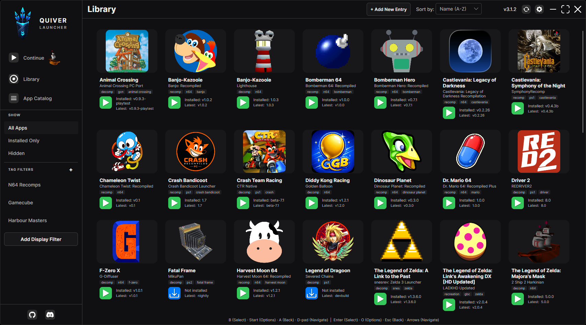

## Hee Hoy! 👋🏿

While everyone I know and care about have been fighting for their life during the AI vs Artist Special Military Operation, the people that I *just know* have been getting drowned by the sudden realities of LLMs being able to do certain parts of their job with or without any need or regards for anything but getting features pushed.

These "people" I'm referring to are naturally programmers. Doesn't matter the skill level, language, coding pattern, or how many apps they have with over 300 deps and 0 users; LLMs have managed to overtake and consume every supposedly enjoyable aspect of this field that used to be programming.

When I was 2 years younger, more naive, and my hairline was more stiff I made a video called ["layoffs, ai and pivoting out of a dying career path"](https://www.youtube.com/watch?v=xTSKTzo5wps) where I ranted like a moron for almost an hour about how AI impacted tech, the job market, and if there was a way out of this. I'm proud to announce to you now that I was half-right, like I always am, but things are so much more complicated now. And in many ways it's worse than I thought it'd get.

## The Wheel Turned

This video was made before Elon Musk destroyed our government and Trump blustered his way into the White House and attempted to destroy the pillars of our Democracy (if you thought I'm not a political person, just because I don't bring it up that often, you do not know me~). It is no longer safe to work a federal job and to cruise towards retirement. It's no longer safe to work at a 'boring' company and do what you are tasked with every day on Jira.

This is because of a combination of factors ranging from the economy/interest rates, a global job market rather than a local one, cost of labor, over-hiring, and the illusion of productivity that AI provides, but I'm only focusing on this last part for this blog post. It's not that I don't have time to get into it all, I do, I just don't wanna.💀

AI is Useful, but it is not *that* useful. As I explained in [explaining the ai bubble, the pop, and your future as an artist during the after party](https://youtu.be/tFw8NwgIDeA?si=cjbY376PFDTahDEo), an LLM is just a pattern recognition machine, like many that have existed before it, but it uses a larger source of data, a mechanism to absorb more beyond it set, and semantics to not just blow past the turing test, but render any work that requires doing the same thing more than once, more or less mute.

That's not how it is now, but it will eventually go there. Yann LeCun's work on World Models, Niantic (the Pokemon Go people)'s efforts in the field of Spatial Computing & Gaussian Splats, and the field of Robotics more generally are going faster and faster as time goes on. The tech is becoming more absurd and we are in more ways than one, already in that Cyberpunk dystopia the teen version of you always dreamed of. 

The difference now is the sky is still blue, you are not yet a cyborg that cannot afford implant updates, and it is unlikely that you will be eating bugs in the future since cloned meat might be on the table instead.

But just because AI cannot do novel work, does not mean it is useless, which the most ardent haters of AI attempt to imply. Any programmer will tell you, that if they weren't already balding before, they'd be as shiny as a polished tile on their head by now. Code, the underlying lattice for which all of tech runs, has been open-source for ages in an effort to create and uphold a people-run world. Internet protocols, libraries, languages, services, open-source runs the world with a glob of toothpaste and a few twigs. Despite the severe lack of funding and donations, it has been a light in the dark of technology for as long as I have been alive.

It's more permissive than the walled garden which is game development by a long shot, and we will get to that later.

That very same ethos of being open, only asking for credit, allowing people to benefit and grow from knowledge is now being turned against this community and hollowing it out from the inside. LLMs, the pattern matching machines, have long since stolen and absorbed the code from these brilliant programmers without permission, compensation or respect for licensing rights. Just as these models have baked in artwork without permission, any public repo, even the niche ones with no stars, have been cut up and fed into these various models, only to be fine-tuned and optimized later on.

In the hands of people who don't even understand what a forloop is, LLMs spit out other people's work at breakneck speeds. The junior that previously cut his teeth by adding a Google Maps API into a webpage is out of space and out of time. Like I mentioned in both AI videos, it doesn't at all matter that AI isn't making "good" or "maintainable" code. It doesn't matter that it's almost impossible to parse without a secondary AI to help you. It doesn't matter that the software spit out the other end is buggy.

Your boss thinks it's good enough. Your users think it's good enough. And you, a lowly scripter who asks for a living wage in exchange for your dedication, intellect, flexibility, and sweat are worth less. Consumers consume slop, despite protesting otherwise, they will gladly gobble up whatever garbage you put in front of them as long as the package looks appealing enough. Your boss just wants the money to keep coming in, and it does, as long as you play the game that your boss' boss wants you to play.

Healthcare? AI. Law? AI. Design firm? AI. Put it in and don't ask questions. Your users, if they even exist, will use whatever the hell you give them because your boss worked out a B2B exclusivity deal for the next 5 years. These poor fucks couldn't switch even if they wanted. The people who made the deal don't even use the tech, and they don't care about what the engineers say because it's cheaper than whatever Microslop attempted to make them use last time.

Every programmer has felt this shift. Writing code was always the least important part of the job, some would argue, but now that argument has grown legs and runs track. In under a minute, the generic CRUD application that businesses used to invest in programmers to create is doable. The problem is now maintaining that application, and we will see how well that goes, but I don't have high hopes for the result.

If everything is built on the same code, from the same sources, from the same time and versions of software, on the same tech stacks, then these things will also share the same vulnerabilities. The same hacks, viruses and trojans can be used, spread and abused.

The number of hacks across the whole tech world has gone up and this will only get worse. AI is finding exploits and ways to crunch against defenses that humans *could* also do, but it required many man hours. A screwdriver is slower than a drill. In addition, you're unlikely to make a hole with a screwdriver without 3 days of work. 

Doesn't matter if the hack is beneficial or malicious. The truth of it all is relative to where you're standing anyways, things are less secure.

This is not a ProtonVPN sponsership jumpscare.

## Going from the Street to the Highway

In recent years, the emulation community has faced their Majora's Mask moment with Nintendo cracking down on multiple projects and critical websites, Sony has stopped printing discs, and game companies are forcing always online services so much that an anti-movement called [Stop Destroying Games](https://citizens-initiative.europa.eu/initiatives/details/2024/000007_en) was pushed into a minor victory for consumer advocacy supporters.

Things were looking grim and while it was possible for Data Hoarders to preserve what we already had and scuttle away into the halls of the Dark Net, along backalley Matrix channels and secret IP routes, all progress on game preservation was almost primed to die.

I don't think I've seen many examples of a Monkey's Paw curling in my life. A Faustian bargain. But I struggle to explain what the hell we've been seeing lately with these [AI Mashup Games](https://www.reddit.com/r/aigamedev/comments/1wwc4na/ai_is_now_letting_people_flawlessly_mash_up_any/) without considering that maybe, we all got exactly what we asked for. There's nothing more liberating and anti-corpo than IP theft.

- Btw, did you know that all my work is under CC-NC-SA? Steal my shit! I don't care if it's my art or my worlds. Steal your ass off. Anyways...

Games, even when built on proprietary tech and specific engines, still fall into the same trappings as all software. One of the bootlicker arguments around Stop Killing Games was that devs couldn't unhook games from the various license agreements they had made with other companies. B2B nonsense. Skyrim can't be opened up because it runs on Havok.

Very intelligent and passionate people within this community of emulation and homebrew have dedicated years, decades, their lives even, to cracking this previously hidden software open for the community to access and modify for a long time now. While some things are easier than others, with the Dreamcast being one of the funniest examples I've heard of, it is not a simple concept to reverse-engineer anything in this medium.

Just because it isn't simple, does NOT mean it has not been done. With screw drivers, developers have unwound the spindles and tangled globs of code. They've defeated obfuscation an rebuilt broken dependencies. Games have had open-source recreations, ports, and decomps forever.

And then the drill of AI came in.

Same exploits. Remember that? Same viruses. Same trojans. Same tech.

I witnessed an explosion that is difficult to describe. It was like a big bang. First was a project claiming to be a native, cross-platform, port of [Majora's Mask](https://www.youtube.com/watch?v=ywWwUuWRgsM). Wide-screen, ray-tracing, 4k, gyro, 60fps, mods, oh my fucking god.

Why would I use an emulator?! Fantastic work!

Then 1 year later, Sonic Unleashed, Jak & Daxter Trilogy, Skate 3...? What the hell is going on?

Open the Quiver Launcher, a new library manager for downloading and organizing this new paradigm of games:

 A Link to the Past, Symphony of the Night, Megaman Legends, Twilight Princess, Soul Caliber 2- every single day, new shit is popping up on this thing.

 You can probably guess why. A drill can make a hole so quickly. All you have to do is point in the general direction, make sure the bit spins the correct way, and a hole will be created. Terabytes of code, functions, methods, strategies, all used and directed at one single goal can easily overcome whatever primitive methods these companies used to protect their IPs from piracy.

 You don't need to emulate your games. You don't need to IPS patch a rom hack. All you need is the decomp. And in this age of LLM, where your boss can make his own little spotify by yapping for a bit then walking away for a few hours, this is Prometheus bringing fire down to humanity.

 But...this is AI.

 ## It's AI Though

 AI is useful, it's not THAT useful. It can get you 90% of the way, and the last 10% is basically impossible to scale. The issue is, for emulation, this has always been the case. We have almost never had perfect 1 to 1 emulation. Games rate from Near Perfect, to Finish-able, to Playable, and then Borked. The gate for success was already low. So what happens when you just move the goal posts and open up options that were simply too labor intensive for developers in this community to focus on?

You get this. Whatever the hell *this* is.

Is this evil? I don't know. It's built on stolen code. All of this is stolen, of course, but this method, that very well could kill emulation at the pace we're going, is this okay? Should this even be something I indulge in? I downloaded the Skate 3 recomp. There are some broken textures and the menus are jittery, but an update fixed that recently. The games update. They expand and breathe. The limitation is just what you are willing to think of as long as you have the money to either run a local model or prompt a bigger model.

Some asshole just recreated Minecraft's systems, building, inventory, combat, breaking and placing blocks, in Elden Ring. Another asshole put Skate 3 into Modern Warfare 2. It's the efforts of these previous decomps that opened the door for new decomps. Every game that was lazy enough to use the same protections are all vulnerable to the same attack. B2B is their cage and for what seems like many games, there is a skeleton key. And if there isn't one, semantic matching will eventually create one.

There's no machine god, there's no ghost in the shell, there's no Hal. AGI is a fake marketing ploy to get more investors for their IPO. They scare you and fear-monger so much that it backfires.

But the danger was never AGI in the first place. The danger was giving a drill to someone who wanted to deconstruct someone else's home. Bio-weapons, Autonomous Weapon Targeting Systems, Flock Cameras, these are not AGI, but they are the dangers that we have always imagined that AGI would bring.

And then, what the hell are you to do as a new dev? An Indie dev without your own engine? Unity and Unreal won't save you. Developing in Godot is basically an act of communism because you can be decompiled faster than I can blink. Your 5 year passion project will be shoved onto a Chinese appstore and someone will make something that overtakes your baby in popularity. People will come into your comment section asking why you're copying ASDA: the Mechanic.

Is this evil?

We can't go back. The wheel turns one way. You cannot eliminate or regulate AI in a way that won't make this worse. Not just because people will start to lie and obfuscate, turning this into an AI arms race, but because you will be beholden to the companies that stole from you in the first place.

Is this okay?

People are vibe-coding mods, and while there are obvious problems, it's also true that gamers and communities are embracing them regardless. Project Zomboid has 2 first person projects in the works, one of them is being used in a mod list that added jumping and mantling. Dying Light meets Project Zomboid, which is what one of my in-progress projects essentially is, is being built in front of my eyes at a speed that I cannot match by hand.

My world is unique and my stories are my own, in that way I feel secure, but is this not scary?

AI cannot create or synthesize things that do not currently exist. Without the brilliant talents who made both Skate 3 and Skyrim to begin with, it's literally impossible for these stupid game mash-ups to exist. That's the wall of LLMs and forever will be, the inability to synthesize.

But it's still nasty isn't it?

I don't know. I've been wrestling and fighting back and forth in my head about this. We are well beyond the simple arena of Art vs AI. We have been for a while, and I've known that it'd go this way for years. But was it going to become like this?

If you are a creator of any kind, is there any reason to create if someone is just going to feed your works into the endless hole of entropy against your will?

Cara, an Anti-AI art platform was forcefully [cracked open and scraped](https://www.forbes.com/sites/robsalkowitz/2026/08/23/artists-built-a-site-to-escape-ai-scrapers-are-coming-for-it-anyway/) by an AI-rapist of sorts. These platforms were always being scraped in truth, but for it to be so blatant and disrespectful- what else are you supposed to call such a breech of consent?

Is this shit evil bro? What is ethical about this? But what the hell are you going to do?

I don't know. I'm not just mixed on this, I'm lost hahaha.

I'm not a naturally optimistic person. I'm the twisted and contorted form of Camus' philosophy, filtered through a mesh screen, mixed with gravel and formed into the loose shadow of a person. I have always believed things would get worse, and if you attempt to stand rigid against life, it will break you. You will snap in two and fail to pick up your pieces.

This era has tested us. All of us.

The morals have failed and degraded. The protections have proven feckless. The road is on fire and standing still is how you get burned on it.

No one is getting "left behind". Not a single AI bro has the insight or awareness to understand what technology is dragging us all into. No one is in control of the train, especially not the idiots playing with the knobs. 

But shouldn't you at some point stand up? Stand up and get snapped in half I mean? Am I too cynical or am I just being realistic?

Ai isn't the special thing people claim it is, but as a tool, it's not something we can ignore. Regulation cannot fix what is inherently just a bunch of numbers in a file. Just as regulations cannot fix a few tool paths for a printed gun. It's foolish to put it kindly.

Fuck, I don't know man. I don't have a conclusion. I don't know if I should be fighting or bending. If I bend, what exactly am I bending toward? What exactly am I hoping to change? 

Well, I certainly cannot stop.

I will create my vision and develop my worlds because I must. Creativity is a chronic disease that I suffer from.

You can scrape and steal from me. My works, worlds, projects and code are open.

I would not exist in the form in which I do now without the generosity and passion of people before me who opened their minds and hearts for me to steal from. Every lesson about torrenting, every discussion about development, every late night session explaining how to navigate the internet in its infancy with safety in mind, all of it made me. 

A black boy who was the first in his family to own a PC or touch technology, sat in the middle of the rural south, far from any tech hub or working group.

That openness changed my life trajectory and it's not something I will ever forget.

The least I can do is pass the torch, despite the rest of the world already being on fire, right? And so I will.

As for AI, I still don't know. I still don't use it for the shit I care about. I likely never will. But I think I have to grow okay with it existing along-side me. It's stupid that somehow this tool has been taken by the worst people rather than the best of us. If it was trained ethically, if it paid reparations to the people it stole from, if it created more enjoyable jobs than it displaced profitable ones, I would even go so far as to forgive it.

But I cannot be grabbed by the balls and yanked around by a fucking next token prediction machine.

And so I will keep going despite the horrors!~ It's all apart of the process. The wheel will turn again, Winter will break into Spring, as it always has, and when we arrive there, I'm really gonna love that sunshine.

GGEZGetWreckedCyaLoser : Luther~✌🏿
